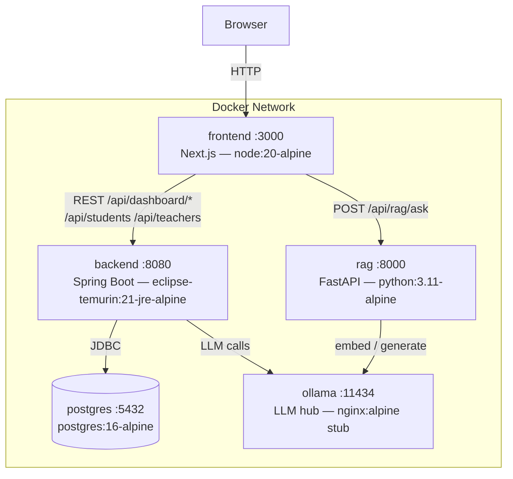

# 🎓 Ucar Platform — Higher-Education Intelligence Dashboard

> **Hack4Ucar** — A full-stack, AI-powered analytics platform for higher-education institutions.  
> Real-time KPI dashboards, multi-institution data management, and an integrated RAG/OCR question-answering engine — all running in Docker.

---

## 📋 Table of Contents

- [Overview](#-overview)
- [System Architecture](#-system-architecture)
- [Tech Stack](#-tech-stack)
- [Project Structure](#-project-structure)
- [Services & Port Map](#-services--port-map)
- [Quick Start (Docker)](#-quick-start-docker)
- [Local Development](#-local-development)
  - [Frontend](#frontend)
  - [Backend](#backend)
  - [RAG / OCR Service](#rag--ocr-service)
- [API Reference](#-api-reference)
  - [Backend REST API](#backend-rest-api)
  - [RAG API](#rag-api)
- [Environment Variables](#-environment-variables)
- [Feature Highlights](#-feature-highlights)
- [Roadmap](#-roadmap)

---

## 🌐 Overview

The **Ucar Platform** is a hackathon-born, production-ready analytics system built for higher-education operators and executives. It provides:

- 📊 **KPI Dashboard** — Academic, Finance, and HR key performance indicators rendered as interactive stat cards, line charts, bar charts, and donut charts.
- 🏫 **Multi-Institution Management** — CRUD operations for Students, Teachers, Courses, and Institutions.
- 🤖 **RAG / OCR Q&A** — Upload PDFs, Excel files, or images (bulletin, conference reports, HR reports). Ask natural-language questions. Get accurate, source-cited answers.
- 🐳 **Fully Containerised** — One `docker compose up` starts the entire platform.

---

## 🏗 System Architecture



### Startup Order

```
postgres → healthy
ollama   → healthy
              └─ backend  → healthy
              └─ rag      → healthy
                                └─ frontend
```

---

## 🛠 Tech Stack

| Layer | Technology |
|---|---|
| **Frontend** | Next.js 16 · React 19 · TypeScript · Tailwind CSS v4 · Recharts · shadcn/ui |
| **Backend** | Spring Boot 4 · Java 21 · Spring Data JPA · Lombok |
| **Database** | PostgreSQL 16 (persistent) · SQLite (RAG embeddings) |
| **RAG / OCR** | FastAPI · Python 3.11 · pdfplumber · OpenAI GPT-4o · pandas · Pillow |
| **LLM Hub** | Ollama (stubbed with nginx in dev; swap for real service) |
| **Container** | Docker · Docker Compose · Alpine-based images |

---

## 📁 Project Structure

```
Hack4Ucar/
├── docker-compose.yaml          # Orchestrates all 5 services
├── docs/
│   ├── architecture-system.md   # System-level Mermaid diagram + port map
│   ├── architecture-backend.md  # Spring Boot layer diagram
│   ├── architecture-frontend.md # Next.js component diagram
│   └── architecture-rag.md      # RAG/OCR pipeline diagram
│
├── FRONTEND/                    # Next.js application
│   ├── app/                     # App Router pages (dashboard, kpi, profile…)
│   ├── components/
│   │   ├── shell/               # AppShell, Sidebar, Topbar
│   │   ├── widgets/             # StatCard, Table, AlertList, KPI widgets
│   │   ├── charts/              # Line, Bar, Donut, Pie, Radar, Area
│   │   ├── dynamic/             # PageRenderer, WidgetRenderer
│   │   └── ui/                  # shadcn/ui primitives
│   ├── hooks/                   # useDashboardData, useUserContext…
│   ├── lib/
│   │   ├── api/                 # dashboard-api, client, dto-adapters, rag-api
│   │   └── mocks/               # Fallback data for offline dev
│   └── types/                   # api-dtos, widget, page-schema, user
│
├── BACKEND/
│   └── BACK/                    # Spring Boot Maven project
│       └── src/main/java/com/hack/back/
│           ├── application/     # REST controllers (Dashboard, Student, Teacher)
│           ├── service/
│           │   ├── kpi/         # DashboardService, AcademicKpiService, FinanceKpiService, HrKpiService
│           │   ├── student/     # StudentService
│           │   └── teacher/     # TeacherService
│           ├── dto/dashboard/   # OverviewDto, ChartDto, FinanceDashboardDto, HrDashboardDto…
│           ├── entity/
│           │   ├── domain/      # Institution, Student, Teacher, Course, Period, UserAccount
│           │   ├── fact/        # Enrollment, AssessmentResult, BudgetFact, HrFact, AttendanceRecord
│           │   ├── kpi/         # Alert, KpiDefinition, KpiObservation
│           │   └── ai/          # Insight, Recommendation
│           └── repository/      # Spring Data JPA repositories
│
├── rag/                         # FastAPI RAG / OCR service
│   ├── app/
│   │   ├── main.py              # FastAPI app, CORS, startup hooks
│   │   ├── services/
│   │   │   └── rag_service.py   # Document loading, Q&A, institution detection
│   │   └── db/
│   │       └── database.py      # SQLite initialisation
│   ├── uploads/                 # Uploaded PDFs, Excel files, images
│   ├── extract_all_documents.py # Batch extraction script
│   ├── setup_rag.py             # One-time setup helper
│   ├── test_rag_endpoints.py    # Endpoint smoke tests
│   └── requirements.txt
│
└── mock/                        # Lightweight nginx stubs (dev mode)
    ├── backend/default.conf     # Fakes /api/dashboard/* + /actuator/health
    └── ollama/default.conf      # Fakes /api/version, /api/generate, /api/chat
```

---

## 🔌 Services & Port Map

| Service | Host Port | Internal Port | Image |
|---|---|---|---|
| **frontend** | 3000 | 3000 | `node:20-alpine` (built locally) |
| **backend** | 8080 | 8080 | `nginx:alpine` mock → swap for Spring Boot |
| **rag** | 8000 | 8000 | `python:3.11-alpine` (built locally) |
| **ollama** | 11434 | 11434 | `nginx:alpine` mock → swap for `ollama/ollama` |
| **postgres** | 5432 | 5432 | `postgres:16-alpine` |

---

## 🚀 Quick Start (Docker)

### Prerequisites

- Docker ≥ 24 & Docker Compose v2
- ~512 MB free RAM (dev/mock profile)

### 1. Clone the repository

```bash
git clone https://github.com/<your-org>/Hack4Ucar.git
cd Hack4Ucar
```

### 2. Start all services

```bash
docker compose up -d
```

### 3. Open the app

| Service | URL |
|---|---|
| Dashboard | http://localhost:3000 |
| Backend API | http://localhost:8080 |
| RAG API | http://localhost:8000/docs |
| PostgreSQL | `localhost:5432` (user: `ucar_user`, db: `ucar_db`) |

### 4. Tear down

```bash
docker compose down -v   # -v removes the postgres volume too
```

### Switching to real services

The compose file ships with lightweight nginx stubs for `backend` and `ollama`. To use the real services:

```yaml
# docker-compose.yaml — backend service
backend:
  build:
    context: ./BACKEND/BACK   # ← replace the nginx image with this
```

```yaml
# docker-compose.yaml — ollama service
ollama:
  image: ollama/ollama:latest  # ← replace the nginx stub
```

---

## 💻 Local Development

### Frontend

> Requires Node.js ≥ 20

```bash
cd FRONTEND
npm install
npm run dev        # http://localhost:3000
```

The frontend will automatically fall back to mock data (`lib/mocks/`) if the backend is unreachable.

**Key scripts**

| Script | Description |
|---|---|
| `npm run dev` | Start Next.js dev server with HMR |
| `npm run build` | Production build |
| `npm run lint` | ESLint check |

---

### Backend

> Requires Java 21 & Maven

```bash
cd BACKEND/BACK
./mvnw spring-boot:run
```

Configure database connection in `src/main/resources/application.properties`:

```properties
spring.datasource.url=jdbc:postgresql://localhost:5432/ucar_db
spring.datasource.username=ucar_user
spring.datasource.password=ucar_pass
spring.jpa.hibernate.ddl-auto=update
```

**Build a JAR**

```bash
./mvnw clean package -DskipTests
java -jar target/BACK-0.0.1-SNAPSHOT.jar
```

---

### RAG / OCR Service

> Requires Python 3.11+ and an OpenAI API key

```bash
cd rag

# 1. Install dependencies
pip install -r requirements.txt

# 2. Copy and edit environment variables
cp .env.example .env
# → set OPENAI_API_KEY=sk-...

# 3. Extract documents (run once)
python extract_all_documents.py

# 4. Start the API
uvicorn app.main:app --reload --port 8000
```

Verify it's running:

```bash
curl http://localhost:8000/health
curl http://localhost:8000/api/rag/documents
```

---

## 📡 API Reference

### Backend REST API

| Method | Path | Description |
|---|---|---|
| `GET` | `/api/dashboard/overview` | Executive overview KPIs (stat cards) |
| `GET` | `/api/dashboard/academic` | Academic KPIs (enrollment trends, pass rates) |
| `GET` | `/api/dashboard/finance` | Finance KPIs (budget vs actual, revenue) |
| `GET` | `/api/dashboard/hr` | HR KPIs (staff count, absenteeism) |
| `GET` | `/api/dashboard/alerts` | Active system alerts |
| `GET` | `/api/dashboard/insights` | AI-generated insights & recommendations |
| `GET` | `/api/students` | List all students |
| `POST` | `/api/students` | Create a student |
| `GET` | `/api/students/{id}` | Get student by ID |
| `PUT` | `/api/students/{id}` | Update a student |
| `DELETE` | `/api/students/{id}` | Delete a student |
| `GET` | `/api/teachers` | List all teachers |
| `POST` | `/api/teachers` | Create a teacher |
| `GET` | `/api/teachers/{id}` | Get teacher by ID |
| `PUT` | `/api/teachers/{id}` | Update a teacher |
| `DELETE` | `/api/teachers/{id}` | Delete a teacher |
| `GET` | `/actuator/health` | Spring Boot health check |

---

### RAG API

Base URL: `http://localhost:8000`

| Method | Path | Description |
|---|---|---|
| `GET` | `/health` | Service health check |
| `GET` | `/api/rag/documents` | List all loaded documents |
| `POST` | `/api/rag/ask?question=...` | Ask a single natural-language question |
| `POST` | `/api/rag/batch-ask` | Ask multiple questions in one request (JSON array) |
| `POST` | `/api/rag/extract-all` | Re-trigger batch document extraction |

**Example — single question**

```bash
curl "http://localhost:8000/api/rag/ask?question=What%20is%20the%20absenteeism%20rate%20at%20IHEC?"
```

```json
{
  "question": "What is the absenteeism rate at IHEC?",
  "answer": "The absenteeism rate at IHEC is...",
  "sources": ["ihec/page_1", "ihec/page_2"],
  "success": true
}
```

**Example — batch questions**

```bash
curl -X POST http://localhost:8000/api/rag/batch-ask \
  -H "Content-Type: application/json" \
  -d '["How many teachers are enrolled?", "What is EYA JABER average grade?"]'
```

The interactive Swagger UI is available at `http://localhost:8000/docs`.

---

## 🔑 Environment Variables

### RAG service (`rag/.env`)

| Variable | Required | Description |
|---|---|---|
| `OPENAI_API_KEY` | ✅ Yes | OpenAI API key for GPT-4o extraction & Q&A |
| `DATABASE_URL` | No | SQLite path (default: `./rag.db`) |
| `OLLAMA_BASE_URL` | No | Ollama endpoint (default: `http://ollama:11434`) |

### Docker Compose (inline)

| Variable | Service | Default |
|---|---|---|
| `POSTGRES_DB` | postgres | `ucar_db` |
| `POSTGRES_USER` | postgres | `ucar_user` |
| `POSTGRES_PASSWORD` | postgres | `ucar_pass` |
| `NEXT_PUBLIC_API_URL` | frontend | `http://localhost:8080` |
| `NODE_OPTIONS` | frontend | `--max-old-space-size=128` |

---

## ✨ Feature Highlights

### 📊 KPI Dashboard
- **12 KPIs** across three domains: Academic, Finance, and HR
- Rendered as stat-cards, line charts, bar charts, donut charts, and list widgets
- Dynamic page schema — layouts are driven by JSON configuration, not hardcoded routes

### 🏫 Institution & People Management
- Full CRUD for Students, Teachers, Courses, and Institutions
- JPA entities covering domain master data, fact tables, KPI observations, and AI insight records

### 🤖 RAG / OCR Q&A Engine
- Supports **PDF**, **Excel (.xlsx)**, and **image** inputs
- OCR via `pdfplumber` and `Pillow` (Tesseract-compatible)
- Keyword-based institution routing: automatically focuses on the relevant document subset
- Strict no-hallucination design — answers are grounded in extracted JSON data

### 🐳 Low-RAM Docker Profile
- Entire stack runs in **< 512 MB** RAM using Alpine images and nginx stubs
- Memory caps enforced via Docker `deploy.resources.limits`
- Production-ready healthchecks with `depends_on` ordering

---

## 🗺 Roadmap

- [ ] Swap nginx stubs with real Spring Boot + Ollama services
- [ ] Add semantic vector search (embeddings) to the RAG pipeline
- [ ] Implement JWT authentication across all services
- [ ] Add PDF pagination support (currently capped at 5 pages)
- [ ] CI/CD pipeline (GitHub Actions → Docker Hub)
- [ ] Kubernetes Helm chart for production deployment

---

## 🤝 Contributing

1. Fork the repository
2. Create a feature branch: `git checkout -b feat/my-feature`
3. Commit your changes: `git commit -m 'feat: add my feature'`
4. Push and open a Pull Request

---

## 📄 License

This project was created for **Hack4Ucar** — a higher-education hackathon. See [LICENSE](LICENSE) for details.
