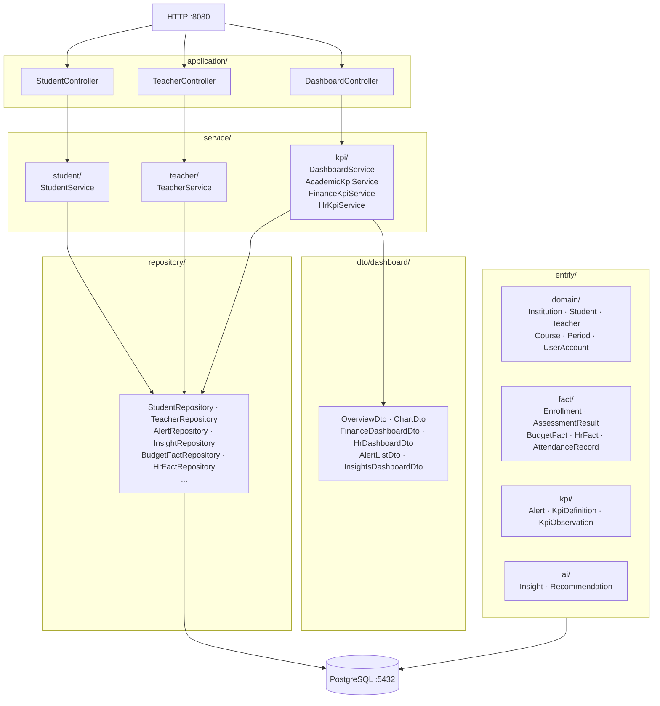

# Backend Architecture

```mermaid
graph TD
    HTTP["HTTP :8080"]

    subgraph application["application/"]
        DC["DashboardController"]
        SC["StudentController"]
        TC["TeacherController"]
    end

    subgraph service["service/"]
        KPI["kpi/\nDashboardService\nAcademicKpiService\nFinanceKpiService\nHrKpiService"]
        STU["student/\nStudentService"]
        TEA["teacher/\nTeacherService"]
    end

    subgraph dto["dto/dashboard/"]
        DTO["OverviewDto · ChartDto\nFinanceDashboardDto · HrDashboardDto\nAlertListDto · InsightsDashboardDto"]
    end

    subgraph entity["entity/"]
        DOM["domain/\nInstitution · Student · Teacher\nCourse · Period · UserAccount"]
        FAC["fact/\nEnrollment · AssessmentResult\nBudgetFact · HrFact · AttendanceRecord"]
        KPI_E["kpi/\nAlert · KpiDefinition · KpiObservation"]
        AI["ai/\nInsight · Recommendation"]
    end

    subgraph repository["repository/"]
        REPO["StudentRepository · TeacherRepository\nAlertRepository · InsightRepository\nBudgetFactRepository · HrFactRepository\n..."]
    end

    DB[("PostgreSQL :5432")]

    HTTP --> DC & SC & TC
    DC --> KPI --> DTO
    SC --> STU
    TC --> TEA
    STU & TEA & KPI --> REPO
    REPO --> DB
    entity --> DB
```
