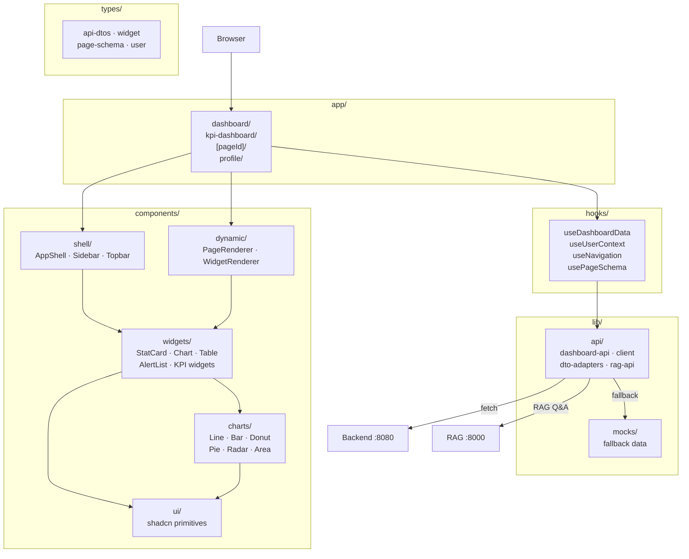

# Frontend Architecture

```mermaid
graph TD
    Browser["Browser"]

    subgraph app["app/"]
        PAGES["dashboard/\nkpi-dashboard/\n[pageId]/\nprofile/"]
    end

    subgraph hooks["hooks/"]
        H["useDashboardData\nuseUserContext\nuseNavigation\nusePageSchema"]
    end

    subgraph lib["lib/"]
        API["api/\ndashboard-api · client\ndto-adapters · rag-api"]
        MOCK["mocks/\nfallback data"]
    end

    subgraph components["components/"]
        SHELL["shell/\nAppShell · Sidebar · Topbar"]
        WIDGETS["widgets/\nStatCard · Chart · Table\nAlertList · KPI widgets"]
        CHARTS["charts/\nLine · Bar · Donut\nPie · Radar · Area"]
        DYNAMIC["dynamic/\nPageRenderer · WidgetRenderer"]
        UI["ui/\nshadcn primitives"]
    end

    subgraph types["types/"]
        T["api-dtos · widget\npage-schema · user"]
    end

    BACK["Backend :8080"]
    RAG["RAG :8000"]

    Browser --> PAGES
    PAGES --> H --> API
    API -->|fetch| BACK
    API -->|fallback| MOCK
    API -->|RAG Q&A| RAG
    PAGES --> SHELL --> WIDGETS --> CHARTS
    PAGES --> DYNAMIC --> WIDGETS
    WIDGETS & CHARTS --> UI
```
