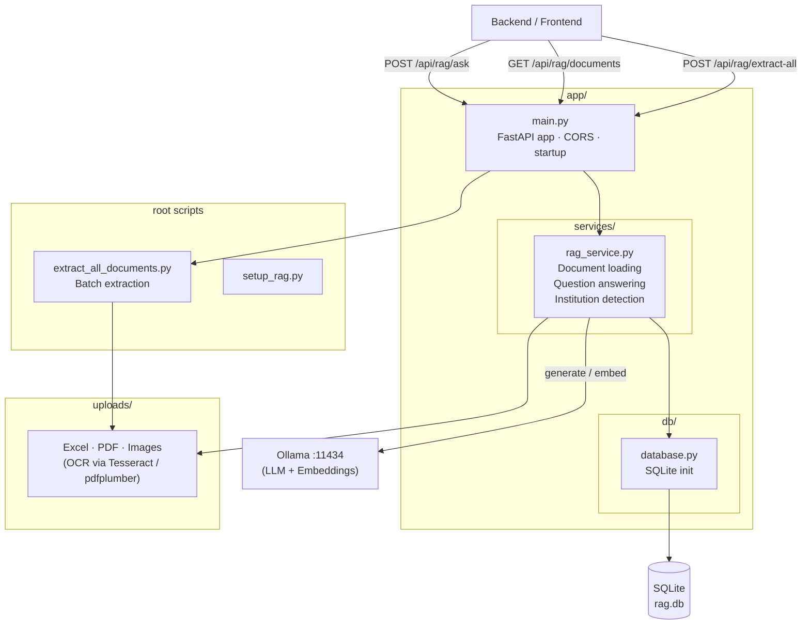

# RAG / OCR Architecture

```mermaid
graph TD
    Client["Backend / Frontend"]

    subgraph app["app/"]
        MAIN["main.py\nFastAPI app · CORS · startup"]

        subgraph services["services/"]
            RAG["rag_service.py\nDocument loading\nQuestion answering\nInstitution detection"]
        end

        subgraph db["db/"]
            DB_M["database.py\nSQLite init"]
        end
    end

    subgraph scripts["root scripts"]
        EXT["extract_all_documents.py\nBatch extraction"]
        SETUP["setup_rag.py"]
    end

    subgraph uploads["uploads/"]
        DOCS["Excel · PDF · Images\n(OCR via Tesseract / pdfplumber)"]
    end

    LLM["Ollama :11434\n(LLM + Embeddings)"]
    SQLITE[("SQLite\nrag.db")]

    Client -->|"POST /api/rag/ask"| MAIN
    Client -->|"GET  /api/rag/documents"| MAIN
    Client -->|"POST /api/rag/extract-all"| MAIN

    MAIN --> RAG
    RAG --> DOCS
    RAG -->|"generate / embed"| LLM
    RAG --> DB_M --> SQLITE
    MAIN --> EXT --> DOCS
```
