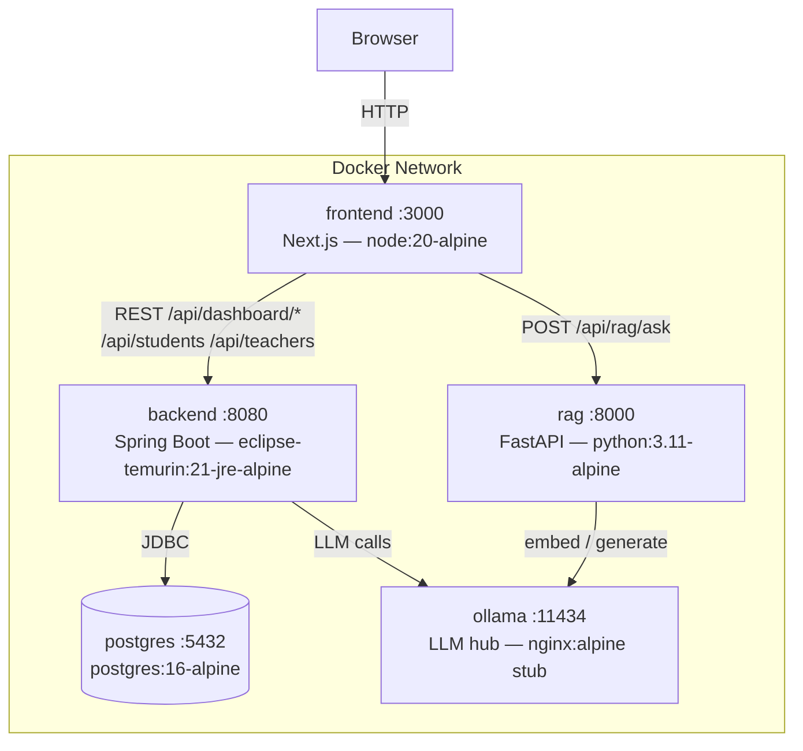

# Ucar Platform — System Architecture



## Startup order

```
postgres → healthy
ollama   → healthy
              └─ backend  → healthy
              └─ rag      → healthy
                                └─ frontend
```

## Port map

| Service  | Host port | Internal |
|----------|-----------|----------|
| frontend | 3000      | 3000     |
| backend  | 8080      | 8080     |
| rag      | 8000      | 8000     |
| ollama   | 11434     | 11434    |
| postgres | 5432      | 5432     |
